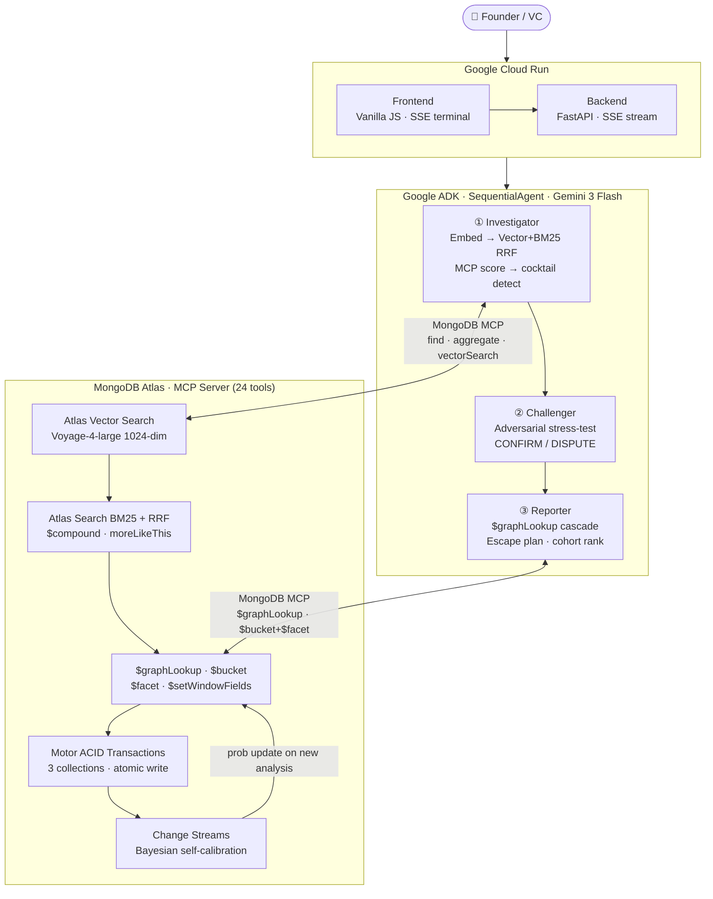

# The Failure Oracle

> Most startups don't fail suddenly. The warning signs show up 3–6 months early — in the numbers. The problem is knowing which numbers matter and what they're telling you.

**The Failure Oracle reads your startup metrics and tells you which documented failure pattern you're heading into — before the crisis hits.**

**Live:** https://oracle-38381883054.us-central1.run.app

---

## The idea

When a YC partner sits across from a founder, they're doing something most founders can't: they recognize patterns. "I've seen this churn number. I know what happens at month 18." That pattern recognition took decades to build. The Failure Oracle makes it available to anyone with a spreadsheet of metrics.

We curated 100 documented failure patterns from YC post-mortems, CB Insights reports, and public founder retrospectives. Each pattern has exact trigger conditions, warning signals with timing, a survival playbook, and real companies that matched it. Enter your 11 key metrics and a 3-agent AI pipeline matches them against this library — with the same specificity an experienced investor would use.

---

## Architecture at a glance



**The flow in one breath:** you enter 11 metrics in the browser → FastAPI hands them to a 3-agent Google ADK pipeline → the **Investigator** embeds them (Voyage AI) and searches the 100-pattern library (Atlas Vector Search + BM25, fused) → the **Challenger** re-checks the match skeptically → the **Reporter** assembles the Oracle Score, Escape Plan, and Cascade. Every step streams back to the terminal live. MongoDB Atlas is the single source of truth throughout — retrieval, graph cascade, cohort stats, and self-calibration all run inside it.

> Full architecture walkthrough and design decisions: [docs/architecture.md](docs/architecture.md) · [docs/adr/](docs/adr/)

---

## What you get from a single analysis

**Pattern Match**
Which of 100 documented failure patterns your metrics most closely resemble. Not a vague label — a specific pattern like "Premature Scaling with Hidden Churn" with a 0–100% confidence score and the exact trigger conditions that fired.

**Oracle Score**
A 0–100 composite health score (100 = healthy, 0 = crisis). Fully transparent — click "Audit formula" to see every penalty and bonus with your actual numbers plugged in. Churn penalty, burn multiple penalty, LTV:CAC penalty, runway penalty, pattern match penalty, plus NPS and growth bonuses. No black box.

**Escape Plan**
The minimum metric changes to drop below the danger threshold. Not AI advice — pure algebra on the pattern's stored trigger conditions. "Reduce monthly churn from 8.2% to 5.5%." Reproducible every time.

**Failure Cascade Graph**
Most tools show *what's failing*. The Oracle shows the full collapse sequence — which failure mode fires next, in how many days, at what probability. Up to 3 hops deep, traversed via MongoDB `$graphLookup`. The probabilities self-improve as real cases are observed via Change Streams.

**Cascade Intervention Optimizer**
For each link in the failure chain: the exact minimum metric change to break it before it propagates. Deterministic algebra, not AI-generated advice.

**Challenger Agent Verdict**
A second independent AI instance re-evaluates every match with deliberate skepticism. If it disagrees with the first agent by more than 10 percentage points, a DISPUTE is flagged. Two agents cross-checking catches false positives a single-agent system would miss.

**Survival Playbook**
Numbered steps used by every company that survived this specific pattern. Not generic advice — sourced from documented cases of the 10–30% who made it through.

**Warning Signals**
Early indicators already visible in your data, with how many days ago they first became detectable. "Runway below 12 months with no improvement in burn multiple — detectable ~150 days ago."

**Historical Outcomes**
Exactly how many companies have hit this pattern, what percentage failed, what percentage survived, and how long they typically had before the crisis.

**Confidence Trajectory**
Run the Oracle monthly on the same startup and it tracks your Oracle Score over time — showing whether risk is increasing, stable, or recovering. Projects your score 1–3 months forward.

**Uncharted Territory**
If your metrics don't closely match any known pattern (best match below 40%), the Oracle says so honestly instead of forcing a weak result.

---

## More features

**Decision Auditor**
Describe any decision before you make it — "Should I hire 5 engineers?" — and the Oracle evaluates it against 100 failure patterns. It shows how similar decisions played out historically and gives a structured risk assessment.

**Oracle Pre-Mortem**
Simulate a decision's impact over 6 months. Gemini projects your metric trajectory at months +1, +3, and +6 — with Oracle Score at each horizon and which failure pattern your month-6 metrics would trigger. Make decisions before they kill you.

**VC Portfolio Mode**
Analyze up to 20 startups at once. The Oracle runs concurrent analysis and returns a risk-ranked dashboard — CRITICAL → HIGH → MODERATE → SAFE. Designed for investors who need a quick read across a portfolio.

**Cohort Intelligence**
See where your Oracle Score sits relative to every similar startup in the database — filtered by industry and startup age. "You're in the 33rd percentile for B2B SaaS at Month 12." Powered by MongoDB `$bucket` + `$facet` aggregation.

**Pattern Library**
Browse all 100 documented failure patterns. Each has: full narrative, trigger thresholds, warning signals with timing, survival playbook, and the real companies that matched it. Filter by category, view as heatmap, click any pattern to expand.

**Continuous Monitoring**
Register your startup for background monitoring. The Oracle re-analyzes every 6 hours and sends a Slack alert if the pattern worsens or changes. Powered by Google Cloud Scheduler + MongoDB Change Streams.

**Stripe Integration**
Import your live MRR, growth rate, and churn directly from Stripe — no manual entry.

**Text Extraction**
Paste any startup text — pitch deck, investor update, YC application — and Gemini extracts all 11 metrics automatically.

**Export & Share**
Download a Markdown forensic brief, generate a board-ready HTML slide deck (Gemini-powered), create a shareable public link, or post directly to Slack.

---

## The 3-agent pipeline

Every analysis runs through a real multi-agent pipeline with live streaming:

```
1. Investigator Agent
   → Embeds your 11 metrics into a 1024-dim vector (MongoDB Voyage AI)
   → Runs Atlas Vector Search (cosine) + Atlas Search (BM25) in parallel
   → Merges results via Reciprocal Rank Fusion → top 5 candidates
   → Fetches category context via MongoDB MCP
   → Scores all 5 candidates with Gemini 3 Flash in parallel (2–4s total)
   → Re-runs with broader candidates if best score < 70%

2. Challenger Agent
   → Second independent Gemini 3 Flash call with a skeptical prompt
   → Actively looks for counter-evidence, not confirmation
   → Returns CONFIRM or DISPUTE + confidence delta

3. Reporter Agent
   → Fetches category benchmarks from MongoDB
   → Synthesizes final output: Oracle Score, Escape Plan, Cascade Graph, Survival Playbook
   → Saves report to database
```

Every step streams to the browser terminal in real time via Server-Sent Events.

---

## Demo scenarios

Click any of these in the UI to load pre-filled metrics and run instantly.

| Scenario | What makes it interesting |
|---|---|
| **Quibi (2020)** | $8.5M/mo burn, LTV:CAC 0.25x — catches "Premature Scaling with Hidden Churn" at 95% |
| **WeWork (Q4 2019)** | $22M burn, 16% churn, LTV:CAC 0.5x — triggers Burn Multiple Death Spiral at 95% |
| **Theranos (2015)** | 45% churn, NPS −42, $5.8M burn on $18K MRR — 98% match, Oracle Score 0 |
| **HighVelocity AI** | Mixed signals — designed specifically to trigger a Challenger **DISPUTE** |
| **Healthy Startup** | Good metrics across the board — shows what a clean result looks like |

---

## Oracle Score formula

Transparent and deterministic — no ML, fully auditable:

```
Base score: 100
− (pattern match confidence × 60)     → up to −60 for a strong pattern match
− min((churn% − 5) × 2,  30)          → penalty kicks in above 5% monthly churn
− min((3 − ltv_cac) × 5, 15)          → penalty for LTV:CAC below 3x
− min((12 − runway) × 1.5, 15)        → penalty for runway below 12 months
− min((burn_mult − 2) × 2, 10)        → penalty for burn multiple above 2x
+ min((nps − 30) / 7, 10)             → bonus for NPS above 30
+ min((growth − 0.10) × 50, 5)        → bonus for MoM growth above 10%
```

**Bands:** STRONG (75–100) · WATCH (50–74) · WARNING (25–49) · CRITICAL (0–24)

---

## Pattern library

100 failure patterns across 12 categories, each with full data:

| Category | Patterns |
|---|---|
| Go-To-Market | 14 |
| Team | 12 |
| Unit Economics | 12 |
| Product-Market Fit | 11 |
| Fundraising | 8 |
| Competition | 8 |
| Product | 8 |
| Premature Scaling | 6 |
| Regulatory | 6 |
| Technical Debt | 6 |
| Platform Risk | 5 |
| Pivot | 4 |

Sources: YC post-mortems, CB Insights, Paul Graham essays, Sequoia/a16z/Bessemer research, public founder retrospectives (Quibi, Theranos, WeWork, Homejoy, Jawbone, Vine).

---

## Tech stack

| | |
|---|---|
| **Google ADK** | SequentialAgent with 3 real LlmAgent sub-agents, each with their own tools and Gemini 3 Flash call |
| **Gemini 3 Flash** | All 3 ADK agents + parallel pattern scoring (`thinking_budget=0` for speed, `=1024` for decision auditing) |
| **MongoDB Atlas Vector Search** | 1024-dim cosine similarity across 100 pattern narratives |
| **MongoDB Atlas Search** | BM25 full-text retrieval, merged with vector results via Reciprocal Rank Fusion |
| **MongoDB MCP Server** | Persistent stdio connection, 24 native tools — critical path for pattern reads |
| **MongoDB Voyage AI** | `voyage-4-large` embeddings, 1024-dim, asymmetric query/document encoding |
| **MongoDB `$graphLookup`** | Failure cascade graph — 3-hop traversal of 47 directed edges across 17 patterns |
| **MongoDB `$bucket` + `$facet`** | Cohort percentile intelligence — 5 sub-pipelines in one query |
| **MongoDB Change Streams** | Watches real A→B pattern transitions, updates Bayesian cascade probabilities live |
| **MongoDB ACID Transactions** | Atomic writes across 3 collections per cascade analysis |
| **FastAPI + Motor** | Async Python backend, parallel scoring via `asyncio.gather` |
| **Server-Sent Events** | Real-time streaming of every agent step to the browser terminal |
| **Google Cloud Run** | Serverless deployment, auto-scaling |
| **Google Cloud Scheduler** | Triggers 6-hour monitoring loop for watched startups |

---

## Running locally

**Prerequisites**
- Python 3.11+
- Node.js 20+ (for MongoDB MCP server)
- MongoDB Atlas account — free M0 tier works
- Gemini API key — [aistudio.google.com/apikey](https://aistudio.google.com/apikey)
- Voyage AI API key — [voyageai.com](https://voyageai.com)

**Install**
```bash
pip install -r requirements.txt
npm install -g mongodb-mcp-server@1.9.0
```

**Configure**
```bash
cp .env.example .env
```

Edit `.env`:
```env
MONGODB_URI=mongodb+srv://...
MONGODB_DB_NAME=oracle_db
GOOGLE_PROJECT_ID=your-gcp-project
GEMINI_API_KEY=AIza...
VOYAGE_API_KEY=pa-...
GEMINI_MODEL=gemini-3-flash-preview
ADK_MODEL=gemini-3-flash-preview
VOYAGE_MODEL=voyage-4-large
```

**Seed the database**
```bash
python -m backend.db.seed
python scripts/seed_cascade_transitions.py
```

**Run**
```bash
uvicorn backend.main:app --reload --port 8080
```

Open `http://localhost:8080`. Click the **Quibi** preset to see the full pipeline run, or **HighVelocity AI** to see the Challenger Agent trigger a DISPUTE.

---

## API endpoints

| Method | Endpoint | What it does |
|---|---|---|
| `POST` | `/api/metrics/analyze` | Full analysis — returns pattern match, Oracle Score, Escape Plan, Cascade |
| `POST` | `/api/metrics/analyze/stream` | Same, with real-time SSE streaming |
| `POST` | `/api/metrics/extract-metrics` | Extract metrics from free-form text (Gemini) |
| `POST` | `/api/audit/evaluate` | Decision audit against 100 patterns |
| `POST` | `/api/audit/pre-mortem` | 6-month decision simulation |
| `POST` | `/api/portfolio/analyze` | Parallel analysis of up to 20 startups |
| `GET` | `/api/cascade/{pattern_id}` | `$graphLookup` cascade chain for a pattern |
| `POST` | `/api/cascade/analyze` | Full cascade + interventions + ACID transaction |
| `GET` | `/api/cascade/cohort/intelligence` | Cohort percentile ranking |
| `GET` | `/api/patterns/` | All 100 patterns (MCP-backed) |
| `POST` | `/api/metrics/watch` | Register for 6-hour background monitoring |
| `POST` | `/api/export/slides` | Generate board-ready HTML slide deck |
| `GET` | `/api/health` | System status — MCP, ADK, model config |

---

## A few honest notes

- **Pattern match ≠ failure probability.** 95% match means the metric signature strongly resembles a documented failure. Survivors exist for every pattern.
- **100 patterns is curated, not exhaustive.** Depth and citation traceability over breadth. The Uncharted Territory path handles what's not in the library.
- **Survival rates are sourced estimates.** Calibrated from public data — directionally accurate, not actuarially precise.
- **English-language sources only.** International failure modes are underrepresented.

---

## License

Apache 2.0 — see [LICENSE](LICENSE)
