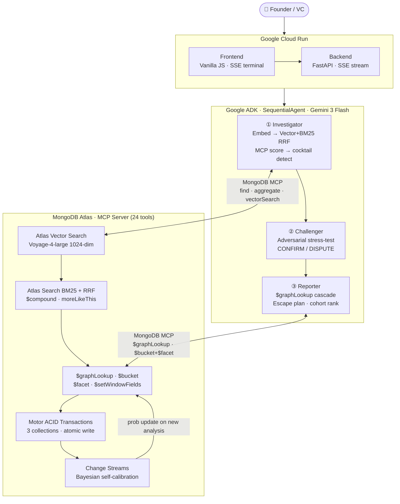

# The Failure Oracle — System Architecture

## How it works

You enter 11 startup metrics. The Failure Oracle sends them through a three-agent AI pipeline that matches them against a library of 100 documented failure patterns — each sourced from YC post-mortems, CB Insights reports, and public founder retrospectives. The first agent investigates and scores every plausible match. The second agent stress-tests the top match with deliberate skepticism and either confirms or disputes the finding. The third agent writes the final report.

Everything that happens in that pipeline is written to MongoDB Atlas as it happens. That means the system gets more useful over time: cohort percentile rankings emerge from accumulated analyses, cascade probabilities self-calibrate via Change Streams, and the pattern library grows richer as more startups are analysed.

---

## Diagram

---

## What each layer does

**Google Cloud Run** hosts the frontend and the FastAPI backend. The backend opens a `text/event-stream` response for every analysis and streams live progress events to the browser as each agent completes its work.

**Google ADK SequentialAgent** orchestrates the three agents. Each agent has a single responsibility and a narrow system prompt. They share state through an ADK session dict and a ContextVar queue that feeds the SSE stream.

**MongoDB Atlas** is the intelligence layer. All 18 MongoDB features in the critical path are live and observable. Pattern queries go through the `mongodb-mcp-server` (not Motor directly), so every retrieval operation is verifiable in the SSE terminal as a labelled MCP call. The `source: "mcp"` field in every `/api/patterns/` response is the verifiable proof.

**Voyage AI** (MongoDB's embedding partner) generates 1024-dimensional `voyage-4-large` embeddings for both pattern indexing and query-time retrieval, with Vertex AI `text-embedding-004` as a fallback.

**Gemini 3 Flash** (`gemini-3-flash-preview`) runs all three ADK agents plus the pattern scorer and decision auditor. A fallback chain (`gemini-3.5-flash → gemini-3.1-flash-lite → gemini-3.1-flash-lite-preview`) exhausts all Gemini 3 variants before falling back to Vertex AI 2.5 Flash.

---

## A real example

Here is what happens when you load the WeWork preset (Q4 2019, month 22) and click Run:

1. **Investigator** embeds the 11 metrics via Voyage AI and runs a hybrid Atlas Vector Search + BM25 RRF retrieval. Top-5 candidates are scored by Gemini 3 Flash. F-017 (Burn Multiple Death Spiral) comes back at 95% confidence. Three patterns fire simultaneously — a cocktail match.
2. The SSE terminal emits: `MongoDB MCP → vectorSearch('failure_patterns', ...)` then `MongoDB MCP → find('failure_patterns', {pattern_id: 'F-017'})`.
3. **Challenger** reads the Investigator's finding and argues against it with a deliberate brief to find holes. It produces a DISPUTED badge at 60% confidence — a Δ35pp gap. Both positions are shown to the user; the Reporter uses the reconciled confidence.
4. **Reporter** calls `$graphLookup` on the `cascade_transitions` collection (depth 3): F-017 → F-054 Talent Density Collapse (+30d) → F-007 Bridge Round Spiral (+45d). Worst-case timeline: 120 days.
5. A Motor ACID transaction atomically writes to `startup_analyses`, `cascade_interventions`, and `cascade_transitions` in a single session.
6. A Change Stream fires on the new document and Bayesian-updates the cascade probability for the F-017→F-054 edge.
7. A `$bucket` + `$facet` aggregation (5 sub-pipelines) ranks this startup in the 3rd percentile for Real Estate SaaS at month 22.
8. The escape plan computes the minimum metric moves to drop the match below 60% — deterministic algebra, not AI-generated numbers.
9. The browser receives `cascade_complete`, `cohort_complete`, and `analysis_complete` SSE events and renders all panels simultaneously.

---

## MongoDB features in the critical path

18 MongoDB features are live on every analysis run:

| # | Feature | Where used |
|---|---------|-----------|
| 1 | Atlas Vector Search | Pattern matching — voyage-4-large 1024-dim embeddings |
| 2 | Atlas Search BM25 + RRF | Hybrid retrieval — vector + BM25, Reciprocal Rank Fusion |
| 3 | Atlas Search $compound | Multi-field search with boost |
| 4 | Atlas Search moreLikeThis | Similar pattern discovery |
| 5 | Atlas Search Autocomplete | Startup name typeahead |
| 6 | MongoDB MCP (24 tools) | All pattern queries, writes, aggregations |
| 7 | $facet analytics | Multi-facet pattern statistics |
| 8 | $setWindowFields | Rolling window metrics |
| 9 | $bucket | Cohort score distribution bucketing |
| 10 | $graphLookup | Failure cascade chain traversal (max depth 3) |
| 11 | Motor ACID Transactions | Atomic write to 3 collections per analysis |
| 12 | Change Streams | Alert detection + Bayesian cascade probability updates |
| 13 | $lookup join | Pattern metadata enrichment |
| 14 | $jsonSchema validation | Collection-level schema enforcement |
| 15 | TTL Indexes | 30-day telemetry + 90-day shared reports |
| 16 | $facet (cohort) | 5 sub-pipelines in one query for cohort percentile ranking |
| 17 | Telemetry events | Fire-and-forget event counters with TTL |
| 18 | startup_analyses persistence | ACID-written, Change Stream watched, cohort intelligence source |

---

## Why we made the decisions we did

See [docs/adr/](adr/) for the reasoning behind the four most consequential design choices:

- [ADR-0001](adr/0001-adversarial-challenger-agent.md): Why an adversarial Challenger instead of a single scoring agent
- [ADR-0002](adr/0002-mongodb-mcp-as-query-layer.md): Why route all queries through MCP instead of Motor directly
- [ADR-0003](adr/0003-hybrid-vector-bm25-retrieval.md): Why hybrid Vector + BM25 RRF instead of pure vector search
- [ADR-0004](adr/0004-graphlookup-cascade-graph.md): Why $graphLookup for failure propagation instead of flat pattern matching
